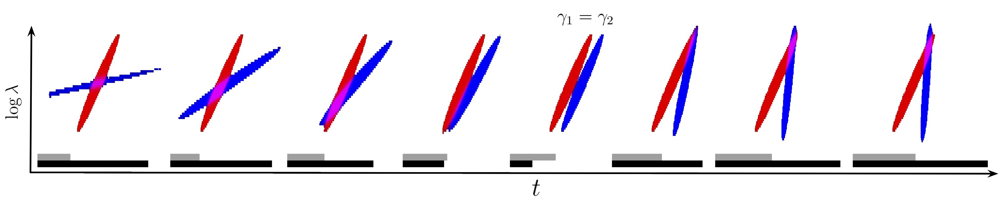

<div align="center">

# Mesostructures: Beyond Spectrogram Loss in Differentiable Time-Frequency Analysis

[Cyrus Vahidi](cyruvahidi.com), Han Han, Changhong Wang and [Vincent Lostanlen](lostanlen.com)

 []()

<br>



# Installing this package
* cuda 11.5
* python 3.8.2
```bash
pip install -editable .
```

</div>

## Abstract
Computer musicians refer to mesostructures as the intermediate levels of articulation between the microstructure of waveshapes and the macrostructure of musical forms. Examples of mesostructures include melody, arpeggios, syncopation, polyphonic grouping, and textural contrast.
Despite their central role in musical expression, they have received limited attention in deep learning.
Currently, autoencoders and neural audio synthesizers are only trained and evaluated at the scale of microstructure: i.e., local amplitude variations up to 100 milliseconds or so.
In this paper, we formulate and address the problem of mesostructural audio modeling via a composition of a differentiable arpeggiator and time-frequency scattering. We empirically demonstrate that time--frequency scattering serves as a differentiable model of similarity between synthesis parameters that govern mesostructure.
By exposing the sensitivity of short-time spectral distances to time alignment, we motivate the need for a time-invariant and multiscale differentiable time--frequency model of similarity at the level of both local spectra and spectrotemporal modulations. 

## Citation
If you use meso-dtfa in your work please consider citing us.
```

```
